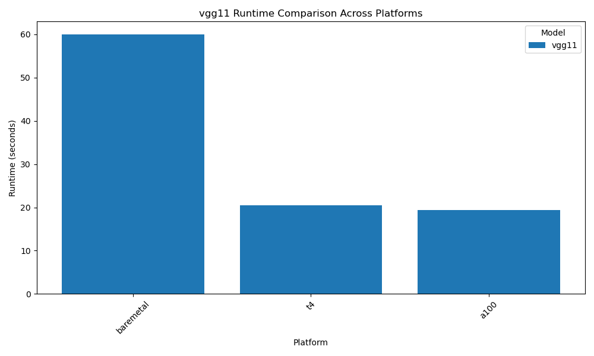
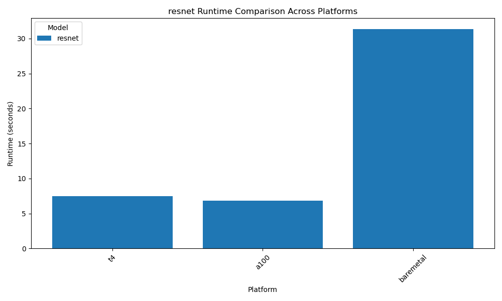

# Experiment Report

## Experiment Design
In this experiment, we aim to compare the runtime performance of two deep learning models, VGG11 and ResNet, across different platforms. The hypothesis is that the ResNet model, due to its deeper architecture, will have a longer runtime compared to VGG11 on the same platform.

## Complexity Estimation 
The complexity of each model is estimated based on the number of layers and operations, such as convolutions and activations. 

### Mathematical Estimation
- **VGG11**: The complexity is primarily determined by the number of convolutional layers and the size of the filters. The computational complexity for a single convolutional layer can be estimated as:
  $\text{Complexity} = O(N \times M \times K^2 \times C)$
  where $(N)$ is the number of output feature maps, $(M)$ is the number of input feature maps, $(K)$ is the kernel size, and $(C)$ is the spatial size of the input feature map.

- **ResNet**: ResNet's complexity is higher due to its deeper architecture and the presence of residual connections. The complexity for a ResNet block can be similarly estimated, but with additional operations for the skip connections.

## Measurement
The runtime of each model was measured using NVIDIA's profiling tools. The results are visualized in the following plots:

### VGG11 Runtime Comparison

### ResNet Runtime Comparison

## Roofline Modeling
Roofline models were constructed to visualize the computational efficiency of each model. These models help in understanding the balance between compute and memory bandwidth, highlighting potential bottlenecks.

### Roofline Model Explanation
The roofline model is a performance model that provides insights into the limitations of a system's performance. It is defined by two main parameters:
- **Operational Intensity (OI)**: The ratio of floating-point operations to memory operations.
- **Performance Boundaries**: Defined by the peak performance of the compute units and the memory bandwidth.

The roofline model can be visualized as:
- **Ceiling**: The peak performance of the compute units.
- **Slope**: The memory bandwidth limit.

The intersection of these lines indicates the maximum achievable performance given the operational intensity.

## Discussion
The results indicate that while ResNet has a higher computational complexity, its performance can be optimized on certain platforms. The roofline model suggests that memory bandwidth is a limiting factor for both models, but more so for ResNet. Further optimizations could focus on improving data locality and reducing memory traffic.

---

### How code was modified
main.py
	2 changes from pytorch-example repo: 
	1. added ncu.start/stop
	2. added VerboseExecut* for better model layer analysis.

git-diff-main.py.log
	Use the diff-log to see what I have changed. The NCU is just 3 lines. Some changes to shorten the runs. A forward hook to print input data to each layers. 

run.sh
	Simple way to run main.py to collect input, data sizes for layers. Useful for complexity estimation
	NO need to get image files. 

vgg11.w.out.log
	corresponding output. Find lecture note materials to finish your complexity computation

hm2_perf_est_measure_ncu_homework_3_help.pdf
hm2_perf_est_measure.pdf
	Above 2 files should be useful to remind you the basics.

NOTES on NCU usage to collect necessary info for roofline , Please check each command line options. 

/share/apps/cuda/11.1.74/bin/ncu --profile-from-start off --metrics gpu__time_duration.sum,dram__bytes_read.sum,dram__bytes_write.sum,smsp__sass_thread_inst_executed_op_fadd_pred_on.sum,smsp__sass_thread_inst_executed_op_fmul_pred_on.sum,smsp__sass_thread_inst_executed_op_ffma_pred_on.sum --csv --page raw --log-file resnet18-v100.csv --target-processes all python main.py /home/sxp8182/imagenet/ -a vgg11 --epochs 1 -b 1 --gpu 0

Explanation: 
	gpu_time_duration.sum	kernel execution time on GPU
	dram_bytes_read		memory traffic
	OTHERS			computations

	This way you have COMPUTE-rate / Mem-traffic-rate
